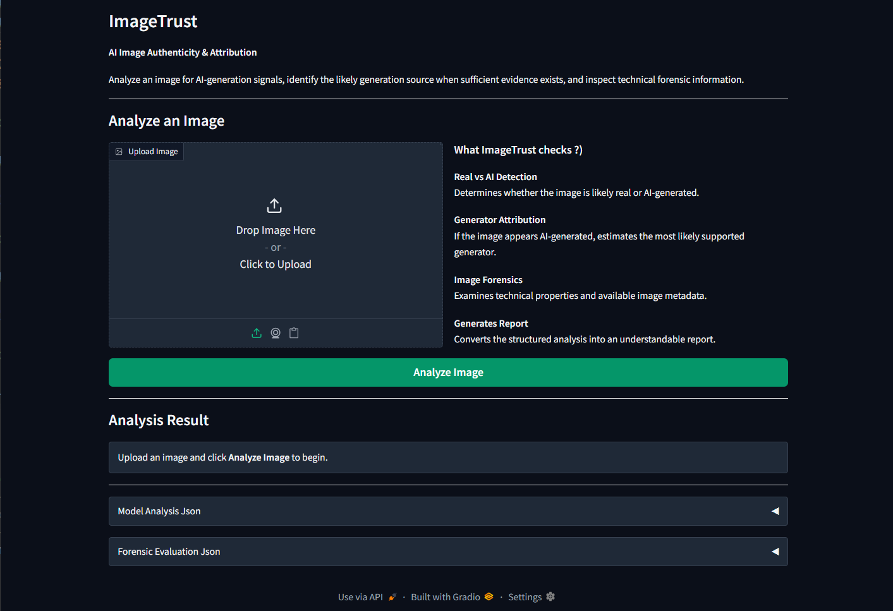
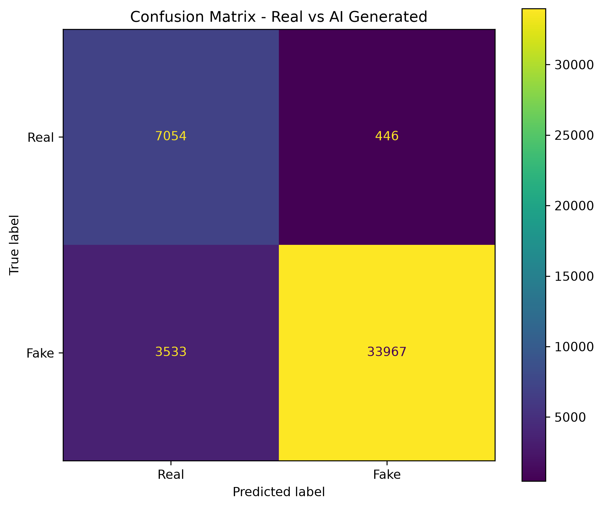
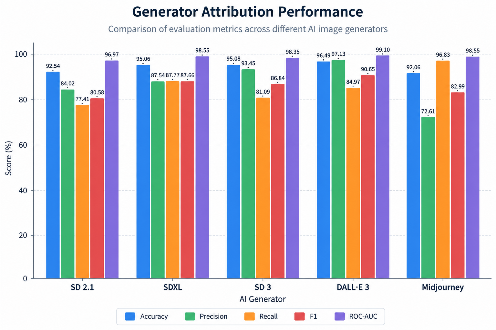

# ImageTrust

### AI Image Detection · Generator Attribution · Digital Forensics · Provenance Analysis

ImageTrust is an AI image forensics platform designed to assess whether an image is **likely real or likely AI-generated**, identify the **most likely supported AI generator**, and provide supporting evidence through traditional digital forensics and provenance analysis.

The system combines two dedicated deep-learning models with OpenCV/Pillow-based forensic analysis, EXIF/XMP/C2PA inspection, and an LLM-powered evidence report.

> **ImageTrust is an evidence-based analysis tool, not an absolute authenticity verifier.**

<p align="center">
  <a href="http://13.50.14.228/"><strong>Live Demo →</strong></a>
  &nbsp;&nbsp;|&nbsp;&nbsp;
  <a href="http://13.50.14.228/"><strong>Watch Demo Video →</strong></a>
</p>

---

## Demo

### Live Application

**[Try ImageTrust Live →](http://13.50.14.228/)**

ImageTrust is deployed on an **AWS EC2 instance** and exposed through its Gradio interface.


### Product Demo Video

**[▶ Watch the ImageTrust Demo](YOUR_DEMO_VIDEO_URL)**

The demo showcases:

1. Image upload
2. Real vs AI classification
3. Classification confidence
4. Generator attribution
5. Attribution confidence level
6. Digital forensic analysis
7. EXIF/XMP/C2PA analysis
8. Automated evidence report

> **TODO:** Add YouTube, Loom, or GitHub-hosted demo video.

### Interface




### Analysis Report


> **TODO:** Add a screenshot showing the final assessment and report.

---

# Overview

AI-generated images are becoming increasingly difficult to distinguish from authentic photographs through visual inspection alone.

ImageTrust approaches this problem as a **multi-signal image forensics task** rather than relying on a single classifier.

The platform evaluates:

- Whether an image is likely real or AI-generated
- Which supported generator the image most closely resembles
- Traditional image-forensic characteristics
- Embedded metadata and provenance
- Combined evidence supporting the final assessment

The final user-facing classification has two states:

- **Likely Real**
- **Likely AI-Generated**

For AI-generated images, ImageTrust additionally reports the most likely supported generator and a qualitative attribution confidence level.

---

# Key Features

## 1. Real vs AI Detection

ImageTrust uses a dedicated deep-learning classifier to distinguish between real and AI-generated images.

The current detector uses a **ResNet18-based architecture**.

The model produces class probabilities which are used by the decision engine to determine the final classification.

Example:

```text
Classification
──────────────
Likely AI-Generated

Confidence
──────────
81.34%
```

---

## 2. AI Generator Attribution

For images classified as likely AI-generated, ImageTrust attempts to identify the most likely supported generator.

The current attribution model evaluates generators including:

- Stable Diffusion 2.1
- Stable Diffusion XL
- Stable Diffusion 3
- DALL·E 3
- Midjourney

Generator attribution also includes a qualitative confidence level:

| Confidence | Interpretation |
|---|---|
| **Very High** | Very strong match among supported generators |
| **High** | Strong generator similarity |
| **Medium** | Moderate similarity |
| **Low** | Weak similarity |
| **Very Low** | Very weak similarity |

Attribution is treated as a **model prediction**, not proof of origin.

A generator outside the supported training classes may be incorrectly attributed to the closest supported class.

---

## 3. Digital Image Forensics

ImageTrust supplements the ML predictions with traditional forensic analysis using OpenCV, Pillow, and NumPy.

Current analysis includes:

### Image Properties

- Image dimensions
- Aspect ratio
- Color channels
- RGB statistics
- Saturation
- Brightness

### Statistical Analysis

- Entropy
- Contrast
- Sharpness
- Blur characteristics
- Noise residuals
- Noise distribution

### Edge & Frequency Analysis

- Edge density
- Edge statistics
- FFT frequency characteristics
- High-frequency energy
- Low-frequency energy

### Compression Analysis

- JPEG detection
- Estimated JPEG quality
- Block artifact analysis
- DCT statistics
- High-frequency DCT energy
- Double-compression indicators

### Image Manipulation Analysis

- Error Level Analysis (ELA)
- Resampling detection
- Interpolation error
- Reconstruction error
- Resizing characteristics

These measurements are supporting signals and are not individually treated as proof of AI generation.

---

## 4. Metadata & Provenance Analysis

ImageTrust analyzes available embedded metadata and provenance information.

### EXIF

The system can extract information such as:

```text
Camera Make
Camera Model
Software
Capture Date/Time
```

### XMP

XMP metadata is inspected for additional embedded information.

### C2PA

ImageTrust checks for **C2PA manifests** when available.

C2PA can provide digitally signed provenance information associated with an image.

> The absence of EXIF, XMP, or C2PA metadata does not prove that an image is AI-generated.

Metadata may be removed, modified, or lost during image processing.

---

## 5. Evidence-Based LLM Report

After the analysis is complete, ImageTrust generates a concise natural-language report.

The report summarizes:

- Final classification
- Detector confidence
- Generator attribution
- Attribution confidence
- Provenance information
- Important forensic signals
- Final conclusion

The LLM does **not** make the final authenticity decision.

```text
ML Models
    │
    ▼
Forensics
    │
    ▼
Provenance
    │
    ▼
Deterministic Decision Engine
    │
    ▼
Structured Analysis
    │
    ▼
LLM
    │
    ▼
Human-readable Report
```

This keeps the final classification grounded in structured analysis rather than an LLM's independent judgment.

---

# System Architecture

```text
                         ┌───────────────────┐
                         │    Image Upload   │
                         └─────────┬─────────┘
                                   │
                                   ▼
                         ┌───────────────────┐
                         │    LangGraph      │
                         │ Analysis Workflow │
                         └─────────┬─────────┘
                                   │
              ┌────────────────────┼────────────────────┐
              │                    │                    │
              ▼                    ▼                    ▼
     ┌────────────────┐   ┌──────────────────┐  ┌─────────────────┐
     │ Real vs AI     │   │ Generator        │  │ Digital         │
     │ Detector       │   │ Attribution      │  │ Forensics       │
     │                │   │                  │  │                 │
     │ ResNet18       │   │ ResNet18         │  │ OpenCV/Pillow   │
     └───────┬────────┘   └─────────┬────────┘  └────────┬────────┘
             │                      │                    │
             │                      │             ┌──────┴───────┐
             │                      │             │              │
             │                      │            EXIF       XMP/C2PA
             │                      │
             └──────────────────────┼────────────────────┘
                                    │
                                    ▼
                         ┌───────────────────┐
                         │  Decision Engine  │
                         └─────────┬─────────┘
                                   │
                    ┌──────────────┴──────────────┐
                    │                             │
                    ▼                             ▼
             ┌─────────────┐             ┌──────────────────┐
             │ Likely Real │             │ Likely AI        │
             └─────────────┘             │ Generated        │
                                          └────────┬─────────┘
                                                   │
                                                   ▼
                                          Generator Attribution
                                                   │
                                                   ▼
                                          ┌──────────────────┐
                                          │ LLM Report       │
                                          │ Generation       │
                                          └────────┬─────────┘
                                                   │
                                                   ▼
                                          ┌──────────────────┐
                                          │ Gradio Interface │
                                          └──────────────────┘
```

---

# How It Works

## Step 1 — Image Upload

The user uploads an image through the Gradio interface.

The original image is passed to the backend for analysis.

## Step 2 — Real vs AI Detection

The first model estimates whether the image is real or AI-generated.

## Step 3 — Generator Attribution

For images classified as likely AI-generated, the attribution model predicts the closest supported generator and provides a confidence level.

## Step 4 — Digital Forensics

Traditional forensic measurements are calculated independently from the ML predictions.

## Step 5 — Provenance Analysis

EXIF, XMP, and C2PA information is inspected when available.

## Step 6 — Deterministic Decision

The decision engine uses the structured model outputs and configured thresholds to produce the final classification:

```text
Likely Real
       or
Likely AI-Generated
```

## Step 7 — Evidence Report

The structured analysis is passed to the LLM, which produces a concise explanation of the evidence.

---

# Model Evaluation

ImageTrust contains **two independently evaluated machine-learning models**.

---

## Real vs AI Detector Performance

**Architecture:** ResNet18

**Task:** Binary classification

**Classes:**

```text
Real
AI-Generated
```

### Overall Metrics

| Metric | Score |
|---|---:|
| Accuracy | **0.9116** |
| Precision | **0.9870** |
| Recall | **0.9058** |
| F1 Score | **0.9447** |
| ROC-AUC | **0.9769** |

> **TODO:** Replace these values with the final held-out test-set results.

### Confusion Matrix



> **TODO:** Add the final confusion matrix.

### ROC Curve


> **TODO:** Add the final ROC curve.


---

# Generator Attribution Performance

The attribution model was evaluated using a **one-vs-rest** approach for each generator.

- **Positive** → The image was generated by the generator being evaluated.
- **Negative** → The image was generated by another generator.

This evaluation measures how effectively the attribution model distinguishes each generator from all other supported generators.

| Generator | Accuracy | Precision | Recall | F1 | ROC-AUC |
|---|---:|---:|---:|---:|---:|
| **SD 2.1** | 92.54% | 84.02% | 77.41% | 80.58% | 96.97% |
| **SDXL** | 95.06% | 87.54% | 87.77% | 87.66% | 98.55% |
| **SD 3** | 95.08% | 93.45% | 81.09% | 86.84% | 98.35% |
| **DALL·E 3** | **96.49%** | **97.13%** | 84.97% | **90.65%** | **99.10%** |
| **Midjourney** | 92.06% | 72.61% | **96.83%** | 82.99% | 98.55% |

### Generator Performance Chart



> **TODO:** Add a bar chart showing F1 score or another selected metric per generator.

---

## Generator Attribution Confusion Matrices

Each matrix evaluates one generator against **all other generators**.

### Matrix Interpretation

| Actual ↓ / Predicted → | Other Generators | This Generator |
|---|---:|---:|
| **Other Generators** | True Negative (TN) | False Positive (FP) |
| **This Generator** | False Negative (FN) | True Positive (TP) |


> **TODO:** Add the combined confusion-matrix visualization.

<details>
<summary>View individual confusion matrices</summary>

### SD 2.1

| Actual ↓ / Predicted → | Other Generators | SD 2.1 |
|---|---:|---:|
| **Other Generators** | 28,896 | 1,104 |
| **SD 2.1** | 1,694 | 5,806 |

### SDXL

| Actual ↓ / Predicted → | Other Generators | SDXL |
|---|---:|---:|
| **Other Generators** | 29,063 | 937 |
| **SDXL** | 917 | 6,583 |

### SD 3

| Actual ↓ / Predicted → | Other Generators | SD 3 |
|---|---:|---:|
| **Other Generators** | 29,574 | 426 |
| **SD 3** | 1,418 | 6,082 |

### DALL·E 3

| Actual ↓ / Predicted → | Other Generators | DALL·E 3 |
|---|---:|---:|
| **Other Generators** | 29,812 | 188 |
| **DALL·E 3** | 1,127 | 6,373 |

### Midjourney

| Actual ↓ / Predicted → | Other Generators | Midjourney |
|---|---:|---:|
| **Other Generators** | 27,261 | 2,739 |
| **Midjourney** | 238 | 7,262 |

</details>

---

# Technology Stack

| Component | Technology |
|---|---|
| Machine Learning | PyTorch |
| Model Architecture | ResNet18 |
| Image Processing | OpenCV |
| Image Metadata | Pillow |
| Numerical Computing | NumPy |
| API | FastAPI |
| Workflow Orchestration | LangGraph |
| LLM Integration | LangChain |
| LLM | OpenAI |
| UI | Gradio |
| Data Validation | Pydantic |
| Database | SQLAlchemy |
| Provenance | EXIF / XMP / C2PA |
| Cloud Deployment | AWS EC2 |

---

# Project Structure

ImageTrust/
│
├── app/
│   ├── main.py
│   │
│   ├── configs/
│   │   └── config.py
│   │
│   ├── database/
│   │   ├── database.py
│   │   ├── db_models.py
│   │   └── init_db.py
│   │
│   ├── frontend/
│   │   └── gradio_ui.py
│   │
│   ├── models/
│   │   ├── forensics_analyzer.py
│   │   ├── generator_attributor.py
│   │   ├── llm.py
│   │   └── real_ai_detector.py
│   │
│   ├── repositories/
│   │   └── analysis_repository.py
│   │
│   ├── schemas/
│   │   └── predictions.py
│   │
│   ├── services/
│   │   ├── analysis_service.py
│   │   └── analyze_provenance.py
│   │
│   └── workflows/
│       └── analysis_graph.py
│
├── models/
│   └── best_models_checkpoint/
│
│
├── Dockerfile
├── compose.yaml
├── requirements.txt
├── requirements-render.txt
├── .dockerignore
├── .gitignore
└── README.md
```
ImageTrust/
│
├── app/
│   ├── models/
│   │   ├── real_ai_detector.py
│   │   ├── generator_attributor.py
│   │   ├── forensics_analyzer.py
│   │   ├── provenance_analyzer.py
│   │   └── llm.py
│   │
│   ├── workflows/
│   │   └── analysis_graph.py
│   │
│   ├── services/
│   │   └── analysis_service.py
│   │
│   ├── schemas/
│   │   └── predictions.py
│   │
│   └── ...
│
├── gradio/
│   └── gradio_ui.py
│
├── models/
│   └── detector.py
│
├── assets/
│   ├── interface.png
│   ├── report.png
│   ├── architecture.png
│   ├── demo.gif
│   ├── real-ai-confusion-matrix.png
│   ├── real-ai-roc.png
│   ├── generator-performance.png
│   └── generator-confusion-matrices.png
│
├── requirements.txt
├── .env.example
├── README.md
└── ...
```

> **TODO:** Update this structure to exactly match the final repository.

---

# Running Locally

## 1. Clone the Repository

```bash
git clone YOUR_GITHUB_REPOSITORY_URL
cd ImageTrust
```

## 2. Create a Virtual Environment

```bash
python -m venv .venv
```

### Windows

```bash
.venv\Scripts\activate
```

### Linux / macOS

```bash
source .venv/bin/activate
```

## 3. Install Dependencies

```bash
pip install -r requirements.txt
```

## 4. Configure Environment Variables

Create a `.env` file:

```env
POSTGRES_DB=POSTGRES_DB
POSTGRES_USER=POSTGRES_USER
POSTGRES_PASSWORD=POSTGRES_PASSWORD
DATABASE_URL=postgresql+psycopg://POSTGRES_USER:POSTGRES_PASSWORD@db:5432/POSTGRES_DB
OPENAI_API_KEY=your_openai_api_key
```


## 5. Add Model Checkpoints

Place the trained model checkpoints in the required directory.

```text
models/best_models_checkpoint
├── bin_task_defactify_best_validation.pth
└── multi_task_defactify_last_checkpoint.pth
```


## 6. Start the FastAPI Backend

```bash
uvicorn app.main:app --reload
```

## 7. Start the Gradio Interface

```bash
python gradio/gradio_ui.py
```

---

# AWS EC2 Deployment

ImageTrust is deployed on an **AWS EC2 instance**.

The deployment demonstrates a complete cloud-hosted inference workflow:

```text
                         Internet
                            │
                            ▼
                  ┌──────────────────┐
                  │  Gradio Client   │
                  └────────┬─────────┘
                           │ HTTP
                           ▼
                  ┌──────────────────┐
                  │    AWS EC2       │
                  │                  │
                  │    FastAPI       │
                  │       │          │
                  │       ▼          │
                  │   LangGraph      │
                  │       │          │
                  │       ▼          │
                  │ ML + Forensics   │
                  └──────────────────┘
```

The deployment demonstrates:

- AWS EC2 provisioning
- Linux server configuration
- Python environment setup
- Backend deployment
- Public HTTP access
- Remote model inference
- Connecting a frontend to a cloud-hosted API


# Configuration

The analysis pipeline uses configurable thresholds for model decisions.

Example:

```python
ai_threshold = 0.70
source_threshold = 0.60
```

These thresholds control when model predictions are considered sufficiently strong for the corresponding system decisions.

---

# Design Principles

### Deterministic Verdicts

The final authenticity classification is produced by the analysis and decision pipeline rather than by the LLM.

### Evidence Over Claims

Forensic metrics and metadata are presented as observations and supporting signals.

### Generator Attribution Is Secondary

Generator attribution is performed after the image is classified as likely AI-generated and is reported with a qualitative confidence level.

### Provenance Is Supporting Evidence

EXIF, XMP, and C2PA information can provide useful provenance evidence but does not independently establish authenticity.

### No Forced Uncertainty State

The current user-facing decision has two outcomes:

```text
Likely Real
Likely AI-Generated
```

The strength of individual model predictions and generator attribution is communicated through confidence scores and attribution confidence levels.

---

# Limitations

ImageTrust should be considered an **experimental forensic analysis system** rather than a definitive authenticity authority.

### AI Detection

- AI detectors can produce false positives and false negatives.
- Performance can vary across datasets and image domains.
- Images from unseen generation methods may be difficult to classify reliably.

### Generator Attribution

- Attribution is limited to supported generator classes.
- High attribution confidence does not prove the original generator.
- An image generated by an unseen model may be attributed to the closest supported class.

### Digital Forensics

- Resizing, recompression, screenshots, and editing can alter forensic signals.
- Individual forensic indicators should not be interpreted as definitive evidence.

### Metadata & Provenance

- EXIF/XMP metadata can be removed or modified.
- C2PA information may not be present.
- Absence of provenance does not establish authenticity.

---

# Future Work

- [ ] Calibrate model confidence scores
- [ ] Expand generator attribution classes
- [ ] Improve cross-generator generalization
- [ ] Evaluate robustness against compression and resizing
- [ ] Add adversarial robustness testing
- [ ] Expand provenance visualization
- [ ] Add batch image analysis
- [ ] Add model explainability visualizations
- [ ] Improve inference performance
- [ ] Add automated evaluation pipelines
- [ ] Improve cloud deployment scalability
- [ ] Add HTTPS/reverse-proxy production configuration

---

# Roadmap

```text
[x] Real vs AI classifier
[x] Generator attribution model
[x] Traditional image forensics
[x] EXIF analysis
[x] XMP analysis
[x] C2PA analysis
[x] LangGraph analysis workflow
[x] Deterministic decision engine
[x] LLM evidence report
[x] Gradio interface
[x] AWS EC2 deployment

[ ] Final benchmark documentation
[ ] Model performance visualizations
[ ] Demo video
[ ] Confidence calibration
[ ] Expanded generator coverage
[ ] Robustness evaluation
[ ] Production deployment improvements
```

---

# Evaluation Assets

The repository is intended to include:

```text
assets/
├── real-ai-confusion-matrix.png
├── real-ai-roc.png
├── generator-performance.png
└── generator-confusion-matrices.png
```

These visualizations make the model evaluation easier to inspect alongside the reported numerical metrics.

> **TODO:** Add the final evaluation charts.

---

# Why ImageTrust?

ImageTrust demonstrates an end-to-end applied AI system rather than an isolated machine-learning model.

The project combines:

```text
Deep Learning
      +
Computer Vision
      +
Digital Forensics
      +
Metadata / Provenance
      +
Workflow Orchestration
      +
LLM Integration
      +
REST API
      +
Cloud Deployment
      +
Interactive UI
```

The project covers the complete path from model inference and evidence extraction to API design, workflow orchestration, user interface, and cloud deployment.

---

# License

**MIT** Add the project license.

---

# Author

**Zaki**

- GitHub: [zakiansari07-art]
- LinkedIn: [linkedin.com/in/zaki-ansari-b54a53194]

---

# Disclaimer

ImageTrust provides an automated assessment based on machine-learning predictions, forensic signals, and available provenance information.

Results such as **Likely Real** and **Likely AI-Generated** represent the system's assessment of the available evidence and should not be interpreted as definitive proof of an image's origin.
